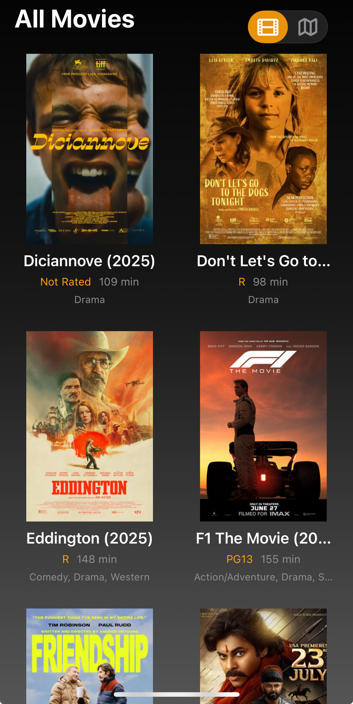
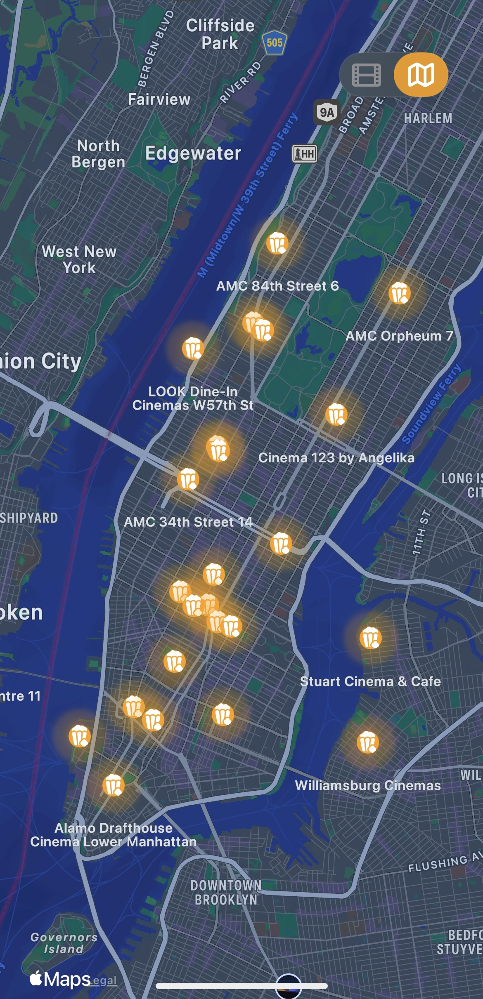
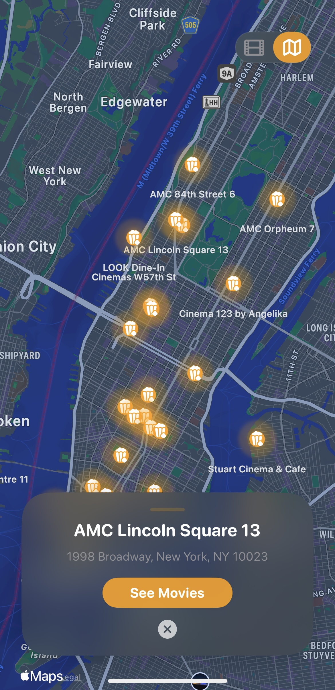
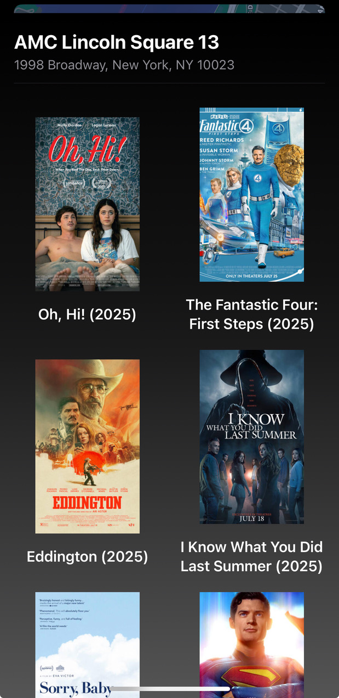
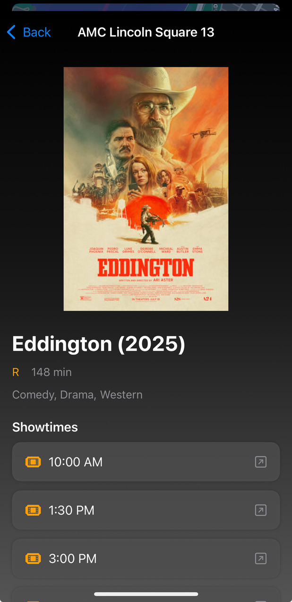

I really hate the fandango app. 

## Features

- Browse a list of nearby movie theaters
- View theaters on an interactive map with custom annotations
- Tap a theater to see its movies
- View detailed information about each movie
- Smooth transitions between map and list views
- Dark mode support
- iOS 17+ only (uses latest SwiftUI and MapKit APIs)
s
## Screenshots
See All Movies Playing Locally
<br>

<br>
Local Theaters Mapped
<br>

<br>
Select a Theater
<br>

<br>
See All Movies
<br>

<br>
Grab Your Ticket
<br>

<br>

## Requirements
- Xcode 15 or later
- iOS 17.0 or later

## Setup
1. Clone the repository:
   ```sh
   git clone <https://github.com/DannyFisher1/movie-finder>
   ```
2. Open `movie.xcodeproj` in Xcode.
3. Build and run on a device or simulator running iOS 17+.

# movies
